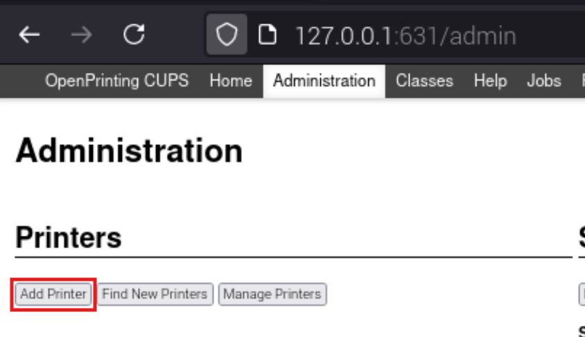
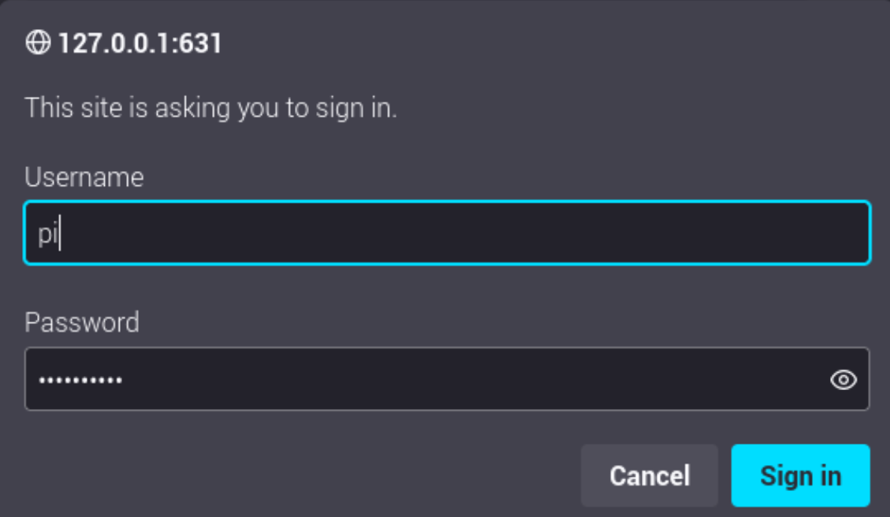
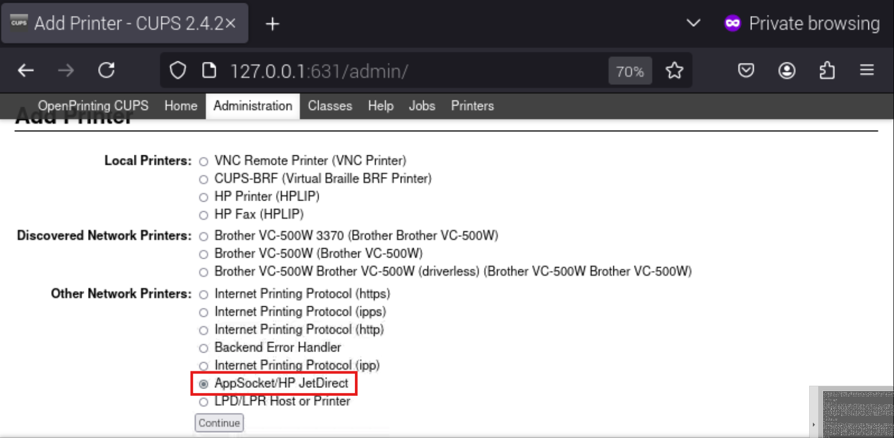
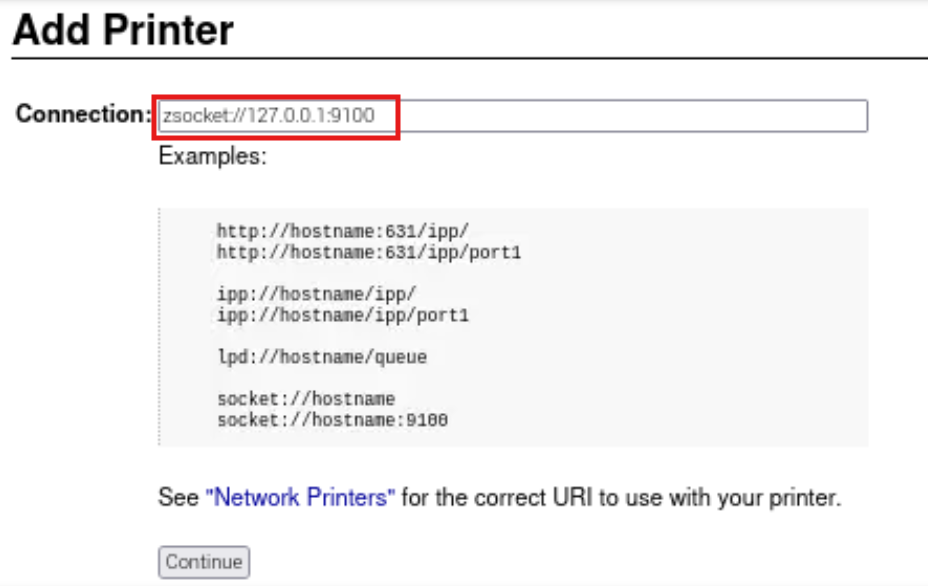
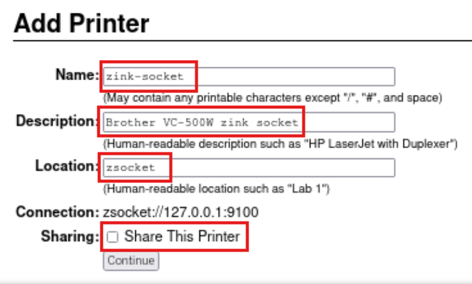
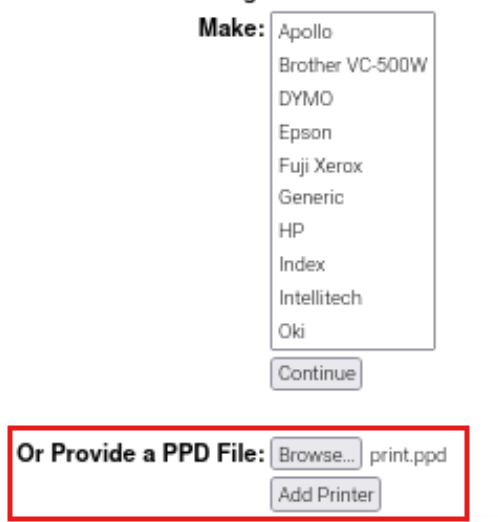
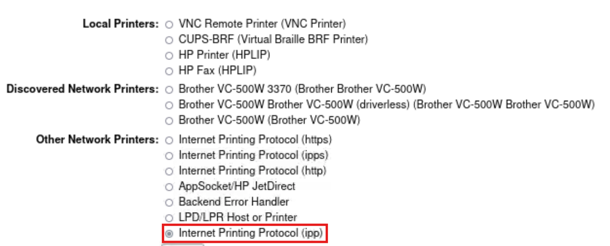
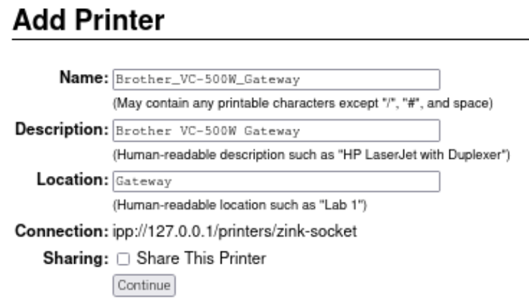
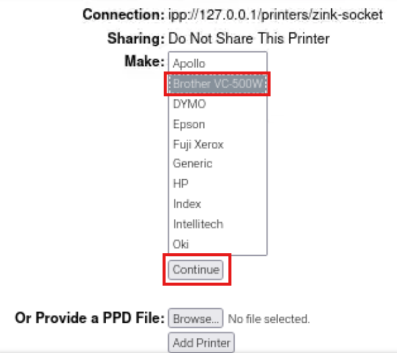
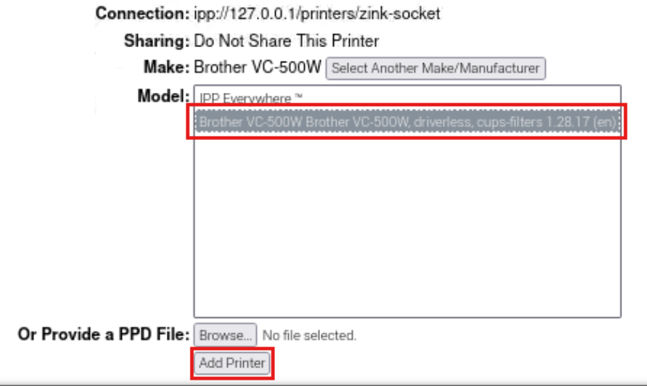

# Introduction

This project aims to enable automatic media cutting after printing on the Brother vc-500w, utilizing CUPS.
We use QEMU to ensure ARM32 compatibility from an ARM64 system to run the official Brother binaries. The proprietary "zsocket" cups backend is used by the pre-installed CUPS on the vc-500w.
Requests are made to localhost:9100 instead of the printer, allowing for on-the-fly request editing via the proxy included in this project.

The binaries are not included in this project for legal reasons and must be obtained from the official website (http://cdn.zinkapps.com/).

# Communication with the printer

**Communication diagram:**

```
+---------------------------------------+
|                User                   |
+---------------------------------------+
    |
    | Initiates printing via CUPS
    v
+---------------------------------------+
|        Brother_VC-500W_Gateway        |
|  Performs various processing on file  |
+---------------------------------------+
    |
    | Sends print job
    v
+---------------------------------------+
| zink-socket (Brother zsocket backend) |
| ipp://127.0.0.1/printers/zink-socket  |
+---------------------------------------+
    |
    | Initiates connection to proxy
    v
+---------------------------------------+
|      127.0.0.1:9100 (Proxy listens)   |
+---------------------------------------+
    |
    | Transfers edited print job
    | request to vc-500w printer.
    v
+---------------------------------------+
|      vc-500w Printer (port 9100)      |
+---------------------------------------+
```
<br>

**Here is a typical exchange between cups and the printer intercepted by the proxy:**

Cups requests to print a picture:
```xml
<?xml version="1.0" encoding="UTF-8"?>
<print>
<speed>0</speed>
<width>327</width>
<height>404</height>
<dataformat>rawrgb</dataformat>
<datasize>396324</datasize>
<quality>4</quality>
<copies>1</copies>
</print>

```

The proxy modifies the request to add `<cutmode>full</cutmode>`:
```xml
<?xml version="1.0" encoding="UTF-8"?>
<print>
<speed>0</speed>
<width>327</width>
<height>404</height>
<dataformat>rawrgb</dataformat>
<datasize>396324</datasize>
<quality>4</quality>
<copies>1</copies>
<cutmode>full</cutmode>
</print>

```

The printer accepts the request.
```xml
<?xml version="1.0" encoding="UTF-8"?>
<status>
<code>0</code>
<comment>ready to receive</comment>
</status>

```

The image is sent raw to the printer which validates the printing:
```xml
<?xml version="1.0" encoding="UTF-8"?>
<status>
<code>0</code>
<comment>print data received</comment>
</status>

```

# Installation

**Prerequisites (with raspberrypi os)**
```bash
apt-get install aqemu qemu-user qemu-user-static python3 cups
```

**Clone this repository**
```bash
# Don't create this folder.
INSTALL_DIR="/opt/vc-500w"
git clone https://github.com/corentin-soriano/vc-500w_autocut.git ${INSTALL_DIR:?}
```

**Create folders**
```bash
mkdir -p ${INSTALL_DIR:?}/{tmp,lib,usr/{bin,lib/cups/backend}}
```

**Get Brother zink firmware from official website**
```bash
FIRMWARE="brotherupgrade-2022071302.tgz"

# Download:
curl -o "${INSTALL_DIR:?}/tmp/${FIRMWARE:?}" "http://cdn.zinkapps.com/${FIRMWARE:?}"

# Extract archive:
tar -xvf "${INSTALL_DIR:?}/tmp/${FIRMWARE:?}" -C "${INSTALL_DIR:?}/tmp/"

```
**Copy files**
```bash
/bin/cp ${INSTALL_DIR:?}/tmp/usr/bin/{pnmscalefixed,zhost} ${INSTALL_DIR:?}/usr/bin/
/bin/cp ${INSTALL_DIR:?}/tmp/usr/lib/*.so* ${INSTALL_DIR:?}/usr/lib/
/bin/cp ${INSTALL_DIR:?}/tmp/usr/lib/cups/backend/zsocket ${INSTALL_DIR:?}/usr/lib/cups/backend/
/bin/cp ${INSTALL_DIR:?}/tmp/lib/*.so* ${INSTALL_DIR:?}/lib/
/bin/cp ${INSTALL_DIR:?}/tmp/etc/cups/ppd/print.ppd ${INSTALL_DIR:?}/

# Remove tmp files.
rm -rf ${INSTALL_DIR:?}/tmp/

# Add execution to binaries.
chmod +x ${INSTALL_DIR:?}/{proxy.py,zsocket_arm64}
chmod +x ${INSTALL_DIR:?}/{lib,usr/{bin,lib/cups/backend}}/*

# Add zink backend to cups.
ln -sf ${INSTALL_DIR:?}/zsocket_arm64 /usr/lib/cups/backend/zsocket

# The only lib we need to put in host /lib.
ln -sf ${INSTALL_DIR:?}/lib/ld-uClibc.so.0 /lib/ld-uClibc.so.0

# Add tools to /usr/bin (the full path is written in the code so we cannot use $PATH).
ln -sf ${INSTALL_DIR:?}/usr/bin/pnmscalefixed /usr/bin/pnmscalefixed
ln -sf ${INSTALL_DIR:?}/usr/bin/zhost /usr/bin/zhost

# Add local install links.
ln -sf ${INSTALL_DIR:?}/usr/lib/libavahi-common.so.3.5.3 ${INSTALL_DIR:?}/usr/lib/libavahi-common.so.3
ln -sf ${INSTALL_DIR:?}/usr/lib/libavahi-client.so.3.2.9 ${INSTALL_DIR:?}/usr/lib/libavahi-client.so.3
ln -sf ${INSTALL_DIR:?}/usr/lib/libz.so.1.2.5 ${INSTALL_DIR:?}/usr/lib/libz.so.1
ln -sf ${INSTALL_DIR:?}/usr/lib/libjpeg.so.8.4.0 ${INSTALL_DIR:?}/usr/lib/libjpeg.so.8
ln -sf ${INSTALL_DIR:?}/usr/lib/libxml2.so.2.7.8 ${INSTALL_DIR:?}/usr/lib/libxml2.so.2
ln -sf ${INSTALL_DIR:?}/usr/lib/libstdc++.so.6.0.13 ${INSTALL_DIR:?}/usr/lib/libstdc++.so.6
ln -sf ${INSTALL_DIR:?}/usr/lib/libdbus-1.so.3.5.8 ${INSTALL_DIR:?}/usr/lib/libdbus-1.so.3
ln -sf ${INSTALL_DIR:?}/lib/ld-uClibc-0.9.30.2.so ${INSTALL_DIR:?}/lib/ld-uClibc.so.0
ln -sf ${INSTALL_DIR:?}/lib/libuClibc-0.9.30.2.so ${INSTALL_DIR:?}/lib/libc.so.0
ln -sf ${INSTALL_DIR:?}/lib/libpthread-0.9.30.2.so ${INSTALL_DIR:?}/lib/libpthread.so.0
ln -sf ${INSTALL_DIR:?}/lib/libm-0.9.30.2.so ${INSTALL_DIR:?}/lib/libm.so.0
ln -sf ${INSTALL_DIR:?}/lib/libcrypt-0.9.30.2.so ${INSTALL_DIR:?}/lib/libcrypt.so.0
ln -sf ${INSTALL_DIR:?}/lib/libdl-0.9.30.2.so ${INSTALL_DIR:?}/lib/libdl.so.0
```

**Restart cups**
```bash
systemctl restart cups.service
```

## Proxy installation
```bash
# Add printer IP or hostname in PRINTER_IP (better with static IP configuration):
vi ${INSTALL_DIR:?}/proxy.py
PRINTER_IP="vc-500w.host" # Replace vc-500w.host by your printer address.

# Add systemd service:
ln -sf ${INSTALL_DIR:?}/cups-proxy.service /etc/systemd/system/cups-proxy.service

# Start and enable proxy on boot.
systemctl enable --now cups-proxy.service

# Check that proxy is started.
systemctl status cups-proxy.service

# Get proxy logs:
journalctl -xeu cups-proxy
# Or like tail -f:
journalctl -xefu cups-proxy
```

## Cups configuration

The printer must be connected via WiFi.

We need to create two printers in cups:
- Zink socket printer.
- IPP Gateway.

**Go to local cups at http://127.0.0.1:631/admin and click on "Add printer":**

<br><br>

**Authenticate with current user/password:**

<br><br>

**Choose "AppSocket/HP JetDirect" and continue:**

<br><br>

**Set connection "zsocket://127.0.0.1:9100":**

<br><br>

**Set name/description/location and don't check "Sharing":**

<br><br>

**Add print.ppd file recovered in step "Copy files (/opt/vc-500w/print.ppd)" (leave "Make" empty):**

<br><br>

**Go back to local cups at http://127.0.0.1:631/admin and click again on "Add printer":**

<br><br>

**Choose "Internet Printing Protocol":**

<br><br>

**Set connection "ipp://127.0.0.1/printers/zink-socket" where "zink-socket" is the name of the printer created previously.**

<br><br>

**Set name/description/location and don't check "Sharing" if not needed:**

<br><br>

**Choose "Brother VC-500W" in list and click on continue (leave PPD file empty):**
*If `Brother VC-500W` does not appear, connect it via USB (you can unplug it immediately after).*

<br><br>

**Choose "Brother VC-500W" in list and click on "Add printer" (leave PPD file empty again):**

<br><br>

## Now you can try to print.
